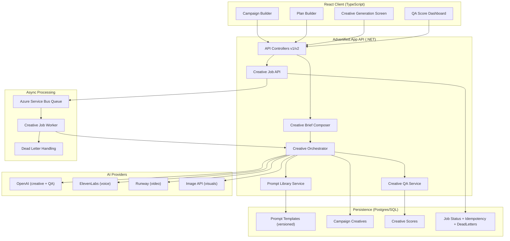

# AI Creative Platform Architecture v1

## 1) Service Architecture (Enterprise, Multi-AI, Queue-Safe)



## 2) Proposed Folder Structure

```text
src/
  Advertified.App/
    AIPlatform/
      Api/
        CreativeApiContracts.cs
      Application/
        Interfaces.cs
        CreativeApplicationModels.cs
        CreativeCampaignOrchestrator.cs
        CreativeJobWorker.cs
      Domain/
        AdvertisingChannel.cs
        CreativeDomainModels.cs
      Infrastructure/
        ServiceCollectionExtensions.cs
        DbPromptLibraryService.cs
        ServiceBusCreativeJobQueue.cs
        AiProviderStrategies.cs
        CreativeServices.cs
    Controllers/
      AiPlatformController.cs
    Configuration/
      AiPlatformOptions.cs
    Data/
      AppDbContext.cs
      AppDbContext.Partial.cs
      AppDbContext.AiPlatform.Partial.cs
      Entities/
        AiPlatformPersistence.cs
        CampaignCreative.cs
        CreativeScore.cs
  Advertified.AIPlatform.Domain/
    Models/
  Advertified.AIPlatform.Application/
    Abstractions/
    Contracts/
    Services/
  Advertified.AIPlatform.Infrastructure/
    Data/
    Providers/
    Queue/
    Repositories/
    Services/
  Advertified.AIPlatform.Api/
    Controllers/
    Middleware/
    Program.cs
    appsettings.json

database/
  bootstrap/
    025_creative_generation_pipeline.sql
    026_ai_platform_production_hardening.sql

src/Advertified.Web/src/
  features/creative/
  pages/creative/
  services/advertifiedApi.ts

tests/
  Advertified.App.Tests/
    AiPlatformTests.cs
```

## 3) Responsibilities by Module

- API Layer
  - Versioned endpoints (`/api/v1`, `/api/v2`)
  - DTO validation, idempotency headers, auth/role enforcement
  - Safe handoff to queue for long-running generation

- Prompt Library System
  - Prompt templates by `key + version + channel`
  - Runtime variable injection (brand, objective, language, CTA)
  - JSON schema contract enforcement for AI output

- Creative Generation Engine
  - Builds normalized brief from campaign + plan
  - Fan-out generation per channel/language
  - Persists creatives + metadata

- Creative QA System
  - Rule checks (length, forbidden claims, policy flags)
  - AI scoring pass (clarity, CTA strength, brand fit, compliance)
  - Structured decision output (`approved`/`needs_revision`)

- Asset Generation Services
  - Voice jobs (ElevenLabs) for radio
  - Image jobs for billboard/digital
  - Video jobs (Runway) for TV/digital
  - Queue-safe callbacks/polling and durable status updates

- Async + Queue
  - `queued -> running -> completed|failed`
  - Exponential retry with max attempts
  - Dead-letter storage and observability endpoint

- Data Layer
  - Prompt templates
  - Creative variants + QA scores
  - Job status, idempotency records, dead letters

- Frontend (React + TypeScript)
  - Campaign Builder and Plan Builder compose structured brief
  - Creative screen displays per-channel outputs and assets
  - QA dashboard and regenerate workflow

## 4) Versioning Strategy

- API: `/api/v1` stable, `/api/v2` for iterative enhancements.
- Prompt templates: semantic prompt versions per key.
- Creative payloads: include `schemaVersion` in JSON.
- QA schema: include `qaVersion` and weighted rubric version.

## 5) JSON Output Contract (AI)

```json
{
  "schemaVersion": "1.0",
  "campaignId": "00000000-0000-0000-0000-000000000000",
  "channel": "Radio",
  "language": "Zulu",
  "creative": {
    "headline": "string",
    "script": "string",
    "cta": "string"
  },
  "qa": {
    "qaVersion": "1.0",
    "score": 0,
    "status": "approved",
    "issues": [],
    "suggestions": []
  }
}
```

